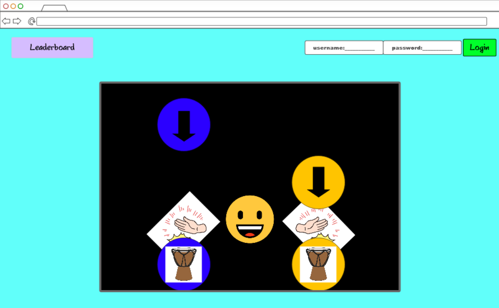

# Rhythm Game

[My Notes](notes.md)

A simple rhythm game with leaderboards.

## 🚀 Specification Deliverable

For this deliverable I did the following. I checked the box `[x]` and added a description for things I completed.

- [x] Proper use of Markdown
- [x] A concise and compelling elevator pitch
- [x] Description of key features
- [x] Description of how you will use each technology
- [x] One or more rough sketches of your application. Images must be embedded in this file using Markdown image references.

### Elevator pitch

Have you grown tired of overpriced and complex games when all you want is quick fun? This web-based application will give you a convenient and *free* way to relive your boredom with a simplistic rhythm game that will keep you chasing high scores. Hit notes to the beat and try to end up on the leaderboards.

### Design

<ins>**Main Page**</ins>

<ins>**Leaderboards Page**</ins>

### Key features

- Log in and out securly over HTTPS.
- High scores saved in a database.
- Highscores shown on a leaderboard, accessible by all users.
- 2 button gameplay
- Rhythm based gameplay with notes falling down on a track.

### Technologies

I am going to use the required technologies in the following ways.

- **HTML** - Basic structure and layout of the application.
- **CSS** - Make everything look more visually appealing, including animation, and support different screen sizes.
- **React** - Build the game interface and reusable components for the game.
- **Service** - Retrieving and submitting scores to the leaderboard. Register, login, and logout users.
- **DB/Login** - Securly store users login credentials and highscores. Only allow highscores to be saved by those with an account.
- **WebSocket** - Broadcast new highscores to all players, which can then be viewed on the leaderboard.

## 🚀 AWS deliverable

For this deliverable I did the following. I checked the box `[x]` and added a description for things I completed.

- [x] **Server deployed and accessible with custom domain name** - [My server link](https://rhythmmonkey.click).

## 🚀 HTML deliverable

For this deliverable I did the following. I checked the box `[x]` and added a description for things I completed.

- [x] **HTML pages** - I have a total of 2 web pages, one for the game and one for the leaderboard. The user can log in from either. 
- [x] **Proper HTML element usage** - My web page contains several different types of HTML elements with proper tags, including a head, title, headers, nav, hyperlinks, buttons, input boxes, and text. 
- [x] **Links** - The home page houses the game and has a link to the leaderboard page. The leaderboard page has a link to the home page.
- [x] **Text** - Both pages contain text, including the title of the webpage and text for each of the placeholders with descriptions of what they are for.
- [x] **3rd party API placeholder** - Placeholder to include embedded video with YouTube Data API
- [x] **Images** - I added a favicon to project and there is also an image displayed on game page.
- [x] **Login placeholder** - User can log in in both HTML pages.
- [x] **DB data placeholder** - Logged in user's high score and the leaderboard scores are initially taken from database.
- [x] **WebSocket placeholder** - User high score and the leaderboard scores are updated with WebSocket.

## 🚀 CSS deliverable

For this deliverable I did the following. I checked the box `[x]` and added a description for things I completed.

- [x] **Header, footer, and main content body** - I created a single .css file that was able to be used with both my html pages. This includes the gradient background.
- [x] **Navigation elements** - Links and login/leaderboard section styled and using flex to keep things aligned with window resize.
- [x] **Responsive to window resizing** - Used flex, max-width, and wrapping so elements adjust properly for smaller screens.  
- [x] **Application elements** - Centered game, video, and leaderboard sections; added borders and spacing. 
- [x] **Application text content** - Set the font, text alignment, and spacing for headings, paragraphs, and forms. 
- [x] **Application images** - Placed images in containers with proper sizing and spacing to fit the layout.

## 🚀 React part 1: Routing deliverable

For this deliverable I did the following. I checked the box `[x]` and added a description for things I completed.

- [ ] **Bundled using Vite** - I did not complete this part of the deliverable.
- [ ] **Components** - I did not complete this part of the deliverable.
- [ ] **Router** - I did not complete this part of the deliverable.

## 🚀 React part 2: Reactivity deliverable

For this deliverable I did the following. I checked the box `[x]` and added a description for things I completed.

- [ ] **All functionality implemented or mocked out** - I did not complete this part of the deliverable.
- [ ] **Hooks** - I did not complete this part of the deliverable.

## 🚀 Service deliverable

For this deliverable I did the following. I checked the box `[x]` and added a description for things I completed.

- [ ] **Node.js/Express HTTP service** - I did not complete this part of the deliverable.
- [ ] **Static middleware for frontend** - I did not complete this part of the deliverable.
- [ ] **Calls to third party endpoints** - I did not complete this part of the deliverable.
- [ ] **Backend service endpoints** - I did not complete this part of the deliverable.
- [ ] **Frontend calls service endpoints** - I did not complete this part of the deliverable.
- [ ] **Supports registration, login, logout, and restricted endpoint** - I did not complete this part of the deliverable.

## 🚀 DB deliverable

For this deliverable I did the following. I checked the box `[x]` and added a description for things I completed.

- [ ] **Stores data in MongoDB** - I did not complete this part of the deliverable.
- [ ] **Stores credentials in MongoDB** - I did not complete this part of the deliverable.

## 🚀 WebSocket deliverable

For this deliverable I did the following. I checked the box `[x]` and added a description for things I completed.

- [ ] **Backend listens for WebSocket connection** - I did not complete this part of the deliverable.
- [ ] **Frontend makes WebSocket connection** - I did not complete this part of the deliverable.
- [ ] **Data sent over WebSocket connection** - I did not complete this part of the deliverable.
- [ ] **WebSocket data displayed** - I did not complete this part of the deliverable.
- [ ] **Application is fully functional** - I did not complete this part of the deliverable.
